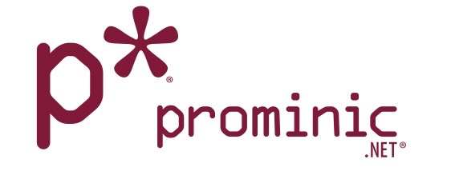

<!-- PROJECT LOGO -->
<br />
<p align="center">
  <a href="https://github.com/prominic/domino4wine-Vagrant-SikuliX/">
    
  </a>

  <h3 align="center">Domino4Wine built on Vagrant</h3>

  <p align="center">
    An README to jumpstart your build of Domino Notes, Administrator and Designer on Linux
    <br />
    <a href="https://github.com/prominic/domino4wine-Vagrant-SikuliX"><strong>Explore the docs »</strong></a>
    <br />
    <br />
    <a href="https://github.com/prominic/domino4wine-Vagrant-SikuliX">View Demo</a>
    ·
    <a href="https://github.com/prominic/domino4wine-Vagrant-SikuliX/issues">Report Bug</a>
    ·
    <a href="https://github.com/prominic/domino4wine-Vagrant-SikuliX/issues">Request Feature</a>
  </p>
</p>


<!-- TABLE OF CONTENTS -->
## Table of Contents

* [About the Project](#domino4wine-vagrant-sikulix)
  * [Built With](#built-with)
* [Getting Started](#getting-started)
  * [Prerequisites](#prerequisites)
  * [Installation](#downloading-domino4wine-vagrant-sikulix-project-to-a-local-folder)
    * [Mac OS X](https://github.com/prominic/domino4wine-Vagrant-SikuliX/blob/master/MacMojaveReadme.md) -- Quick Start
    * [Windows](https://github.com/prominic/domino4wine-Vagrant-SikuliX/blob/master/Win10ReadMe.md) -- Quick Start
* [Rebuilding](#rebuilding-the-project)
* [Roadmap](#roadmap)
* [Contributing](#contributing)
* [License](#license)
* [Contact](#authors)
* [Acknowledgements](#acknowledgments)


# domino4wine-Vagrant-SikuliX
Primary goal is to use Vagrant on Windows, Mac, and Linux to deploy Crossover in an Ubuntu 19.04 VM, in order to run regression tests and automating GUI based installations and configuration of applications.

Our Primary Focus is on IBM Notes, Designer and Administrator, however this project is meant to be used as multi-tool for other projects that require GUI based automation.

We will keep the Master branch as the core of the project and any application that we want to Automate/Regression Test we will branch in order to compartmentalize the project for use with mutiple applications.
 
## Getting Started

These instructions will get you a copy of the project up and running on your local machine for development and testing purposes. You MUST have the Vagrant, Virtualbox and Git installed on your machine. Please follow the instructions below for setting up your VM with the pre-requistes. 

### Prerequisites

You will need some software on your PC or Mac:

```
git
Vagrant
Virtualbox
```

### Installing

To ease deployment, we have a few handy scripts that will utlize a package manager for each OS to get the pre-requisite software for your host OS. This is NOT required, this is to help you ensure you have all the applications that are neccessary to run this VM.

#### Windows
Powershell has a package manager named Chocalatey which is very similar to SNAP, YUM, or other Package manager, We will utilize that to quickly install Virtualbox, Vagrant and Git.

Powershell
```powershell
Set-ExecutionPolicy Bypass -Scope Process -Force; iex ((New-Object System.Net.WebClient).DownloadString('https://chocolatey.org/install.ps1'))
choco install vagrant
choco install virtualbox
choco install git.install
```

For those that need to run this in a Command Prompt, you can use this:

CMD
```bat
@"%SystemRoot%\System32\WindowsPowerShell\v1.0\powershell.exe" -NoProfile -InputFormat None -ExecutionPolicy Bypass -Command "iex ((New-Object System.Net.WebClient).DownloadString('https://chocolatey.org/install.ps1'))" && SET "PATH=%PATH%;%ALLUSERSPROFILE%\chocolatey\bin"
choco install vagrant
choco install virtualbox
choco install git.install
```

#### Mac
Just like Windows and other Linux repos, there is a similar package manager for Mac OS X, Homebrew, We will utilize that to install the prequsites. You will likley need to allow unauthenticated applications in the Mac OS X Security Settings, there are reports that Mac OS X Mojave will require some additional work to get running correctly. You do NOT have to use these scripts to get the pre-requisites on your Mac, it is recommened, you simply need to make sure you have the 3 applications installed on your Mac.

```shell
/usr/bin/ruby -e "$(curl -fsSL https://raw.githubusercontent.com/Homebrew/install/master/install)"
brew cask install virtualbox
brew cask install vagrant
brew cask install vagrant-manager
brew install git
```

#### CentOS 7
We will utilize YUM and a few other bash commands to get the Virtualbox, Git,  and Vagrant installed.

YUM
```shell
yum -y install gcc dkms make qt libgomp patch kernel-headers kernel-devel binutils glibc-headers glibc-devel font-forge
cd /etc/yum.repo.d/
wget http://download.virtualbox.org/virtualbox/rpm/rhel/virtualbox.repo
yum install -y VirtualBox-5.1
/sbin/rcvboxdrv setup
yum -y install https://releases.hashicorp.com/vagrant/1.9.6/vagrant_1.9.6_x86_64.rpm
sudo yum install git
```

#### Ubuntu
We will utilize APT to get the Virtualbox, Git,  and Vagrant installed.

APT
```shell
sudo apt-get install virtualbox vagrant git-core -y 
```

## Downloading domino4wine-Vagrant-SikuliX Project to a Local folder

Open up a terminal and perform the following git command in order to save the Project to a local folder:

```shell
git clone https://github.com/prominic/domino4wine-Vagrant-SikuliX.git

```
### Configuring the Environment
Once you have navigated into the projects directory. You will need to modify the Hosts.yml to your specific Environment.
Please set the configuration file with the correct, Network and Memory and CPU settings your host machine will allow, as these may vary from system to system, I cannot predict your Machines CPU and Network Requirements. You will need to make sure that you do not over allocate CPU, and RAM. In regards to Networking, you MUST change the networking, you will need to set the IP to that of one that is not in use by any other machine on your network.

If you want to change to a different branch for different Application Builds, change the branch variable to that of an existing branch in this repo, in the Hosts.yml

```
cd domino4wine-Vagrant-SikuliX
vi Hosts.yml
```


#### Commonly Changed Parameters:

* ip: Use any IP on your Internal Network that is NOT in use by any other machine.
* gateway: This is the IP of your Router
* identifier: This is the Hostname of the VM, make sure this is a Fully Qualified Domain Name
* mac: This is your machines Network unique identifier, if you run more than one instance on a network, randonmize this. [Mac Generator](https://www.miniwebtool.com/mac-address-generator/)
* netmask: Set this to the subnet you have your network configured to. This is normally: 255.255.255.0
* name: The Vagrant unique identifier
* cpu: The number of cores you are allocating to this machine. Please beware and do not over allocate. Overallocation may cause instability
* memory: The amount of Memory you are allocating to the machine.  Please beware and do not over allocate. Overallocation may cause instability


Once you have configured the Hosts.yml file. You should now be set to go on getting the VM up and running.

### Starting the VM
The installation process is estimated to take about 15 - 30 Minutes. 

```
vagrant up
```

#### Example of a Succesful run:

<details><summary>Details:</summary>
<p>

#### Example of a Succesful run:

```powershell
 vagrant up
==> domino4wine: Checking if box 'Makr44/Sikulix-19.04' version '0.0.1563344996' is up to date...
==> domino4wine: Clearing any previously set forwarded ports...
==> domino4wine: Fixed port collision for 22 => 2222. Now on port 2200.
==> domino4wine: Clearing any previously set network interfaces...
==> domino4wine: Specific bridge '1) Bridge' not found. You may be asked to specify
==> domino4wine: which network to bridge to.
==> domino4wine: Available bridged network interfaces:
1) enp4s0
2) enp7s0f0
3) enp7s0f1
4) enp8s0f0
5) enp8s0f1
6) enp2s0
==> domino4wine: When choosing an interface, it is usually the one that is
==> domino4wine: being used to connect to the internet.
    domino4wine: Which interface should the network bridge to? 1
==> domino4wine: Preparing network interfaces based on configuration...
    domino4wine: Adapter 1: nat
    domino4wine: Adapter 2: bridged
==> domino4wine: Forwarding ports...
    domino4wine: 22 (guest) => 2200 (host) (adapter 1)
==> domino4wine: Running 'pre-boot' VM customizations...
==> domino4wine: Booting VM...
==> domino4wine: Waiting for machine to boot. This may take a few minutes...
    domino4wine: SSH address: 127.0.0.1:2200
    domino4wine: SSH username: vagrant
    domino4wine: SSH auth method: private key
==> domino4wine: Machine booted and ready!
[domino4wine] GuestAdditions 6.0.8 running --- OK.
==> domino4wine: Checking for guest additions in VM...
==> domino4wine: Setting hostname...
==> domino4wine: Configuring and enabling network interfaces...
==> domino4wine: Mounting shared folders...
    domino4wine: /vagrant => /root/domino4wine-Vagrant-SikuliX-19.04/conf
==> domino4wine: Running provisioner: shell...
    domino4wine: Running: /tmp/vagrant-shell20190717-30483-1ezd73i.sh
    domino4wine: A Branch is specified, Adding Branch Domino-Notes
    domino4wine: Cloning into '/temp'...
==> domino4wine: Running provisioner: ansible_local...
    domino4wine: Running ansible-playbook...

PLAY [all] *********************************************************************

TASK [Gathering Facts] *********************************************************
ok: [domino4wine]

TASK [Running Tasks] ***********************************************************
included: /vagrant/ansible/extras/Domino-Notes.yml for domino4wine => (item=/vagrant/ansible/extras/Domino-Notes.yml)

TASK [Remove IDE from Starting] ************************************************
ok: [domino4wine]

TASK [Add Jenkins Jobs] ********************************************************
changed: [domino4wine]

TASK [Changing perm of Jenkins] ************************************************
changed: [domino4wine]

TASK [add Xvfb Plugin details] *************************************************
ok: [domino4wine]

PLAY RECAP *********************************************************************
domino4wine                : ok=6    changed=2    unreachable=0    failed=0

==> domino4wine: Running provisioner: reload...
==> domino4wine: Attempting graceful shutdown of VM...
==> domino4wine: Checking if box 'Makr44/Sikulix-19.04' version '0.0.1563344996' is up to date...
==> domino4wine: Clearing any previously set forwarded ports...
==> domino4wine: Clearing any previously set network interfaces...
==> domino4wine: Specific bridge '1) Bridge' not found. You may be asked to specify
==> domino4wine: which network to bridge to.
==> domino4wine: Available bridged network interfaces:
1) enp4s0
2) enp7s0f0
3) enp7s0f1
4) enp8s0f0
5) enp8s0f1
6) enp2s0
==> domino4wine: When choosing an interface, it is usually the one that is
==> domino4wine: being used to connect to the internet.
    domino4wine: Which interface should the network bridge to? 1
==> domino4wine: Preparing network interfaces based on configuration...
    domino4wine: Adapter 1: nat
    domino4wine: Adapter 2: bridged
==> domino4wine: Forwarding ports...
    domino4wine: 22 (guest) => 2200 (host) (adapter 1)
==> domino4wine: Running 'pre-boot' VM customizations...
==> domino4wine: Booting VM...
==> domino4wine: Waiting for machine to boot. This may take a few minutes...
==> domino4wine: Machine booted and ready!
[domino4wine] GuestAdditions 6.0.8 running --- OK.
==> domino4wine: Checking for guest additions in VM...
==> domino4wine: Setting hostname...
==> domino4wine: Configuring and enabling network interfaces...
==> domino4wine: Mounting shared folders...
    domino4wine: /vagrant => /root/domino4wine-Vagrant-SikuliX-19.04/conf
==> domino4wine: Detected mount owner ID within mount options. (uid: 900 guestpath: /vagrant)
==> domino4wine: Detected mount group ID within mount options. (gid: 900 guestpath: /vagrant)
==> domino4wine: Machine already provisioned. Run `vagrant provision` or use the `--provision`
==> domino4wine: flag to force provisioning. Provisioners marked to run always will still run.
==> domino4wine: Running provisioner: ansible_local...
    domino4wine: Running ansible-playbook...

PLAY [all] *********************************************************************

TASK [Gathering Facts] *********************************************************
ok: [domino4wine]

TASK [Addint Python3 PSUtil] ***************************************************
ok: [domino4wine]

TASK [Disabling Power savings and Lock Screen] *********************************
ok: [domino4wine]

TASK [Disabling Power savings and Lock Screen] *********************************
ok: [domino4wine]

TASK [Disabling Power savings and Lock Screen] *********************************
ok: [domino4wine]

TASK [Disable Lock on suspend] *************************************************
ok: [domino4wine]

TASK [correct java version selected] *******************************************
ok: [domino4wine]

TASK [Set Display to 1440x900] *************************************************
changed: [domino4wine]

TASK [Set Display to 1440x900] *************************************************
changed: [domino4wine]

TASK [Adding Desktop Icon for Sikulix] *****************************************
changed: [domino4wine]

TASK [Adding Jenkins to Autostart] *********************************************
changed: [domino4wine]

TASK [Changing perm of Desktop Icon] *******************************************
changed: [domino4wine]

PLAY RECAP *********************************************************************
domino4wine                : ok=12   changed=5    unreachable=0    failed=0

==> domino4wine: Running provisioner: shell...
    domino4wine: Running: /tmp/vagrant-shell20190717-30483-2q9v98.sh
    domino4wine: alias ..='cd ..'
    domino4wine: alias ...='cd ../..'
    domino4wine: alias h='cd ~'
    domino4wine: alias c='clear'
    domino4wine: alias ll='ls -la'
```
</p>
</details>


During this process the VM will restart twice, You will be promopted if you have multiple network cards, to select and active network card on your system.

Once the VM is fully setup, You should be able to RDP into the VM or use the Virtualbox GUI to manage the VM. If you are using RDP, simply RDP to the IP you setup in the Host.yml.

You should be able to RDP into your VM via the IP address you specified in the Host.yml, and you will be prompted after entering RDP for the login name and password. Login with the username Vagrant, and the Password Vagrant.

### Running Sikulix

Once you are logged in, you can now launch Sikulix from the Desktop Icon.

## Location of Sikulix Scripts and Jenkins Jobs -- Important

On the VM, you can find the Sikulix Scripts on the ROOT of The VMs drive. In the VM use the File Explorer to navigate to the ROOT of the drive. Then open up the /vagrant folder. This folder is shared with your Host Machine, any file you place in this will be accessible to both machines. 

This Folder on the VM, exists in the folder that you downloaded. So if you were on your Desktop and ran the git command, You would go to your desktop, then into the Vagrant Project Folder, then to the "conf" folder. If you  look closely you will see the same files that are on the Vagrant VM. in the Vagrant Share folder.

We recommend testing the scripts on the VM, and then uploading them to Git from the Host.

### Moving IBM Notes Installers to the VM
Before you can run the Sikulix Jobs that will install Notes. You will need to place the Installer Files into their respective installation folders in the Vagrant Share folder.

##### "domino4wine-Vagrant-SikuliX" is just a placeholder for the folder you saved the git project to.

#### Notes 9
- Place the Base Installer EXE into Vagrant Shared folder, on the host it would be: domino4wine-Vagrant-SikuliX/conf/AppInstall/ND9/base/
- Place the latest Fix Pack Installer EXE into the Vagrant Shared Foldder,  on the host it would be: domino4wine-Vagrant-SikuliX/conf/AppInstall/ND9/FP/
- Place the latest Hot Fix Installer EXE into the Vagrant Shared Foldder,  on the host it would be: domino4wine-Vagrant-SikuliX/conf/AppInstall/ND9/HF/

#### Notes 10
- Place the Base Installer EXE into Vagrant Shared folder,  on the host it would be: domino4wine-Vagrant-SikuliX/conf/AppInstall/ND10/base/
- Place the latest Fix Pack Installer EXE into the Vagrant Shared Foldder,  on the host it would be: domino4wine-Vagrant-SikuliX/conf/AppInstall/ND10/FP/
- Place the latest Hot Fix Installer EXE into the Vagrant Shared Foldder, on the host it would be: domino4wine-Vagrant-SikuliX/conf/AppInstall/ND10/HF/

### Installing Notes

Once you have placed the files into the respective folders. You will then use a browser on your Host Machine, and navigate to http://IP.IN.HOST.YML:8080  which will show Jenkins and a list of Jobs that can be ran.

Execute The Jobs in this order for the Version of Notes you respectively want to install:
1) Install Notes Bottle
2) Install Notes Base
3) Install Notes Fix Pack
4) Install Notes Hot Fix

Right now, I recommend to manually install Notes on top of Crossover as the Sikulix Scripts are fragile and may not always work due to the fragility of the Sikulix Scripts and the environment it is run in. 

Later this is likley to be simplied to a Single task that calls each of these. This should open and install the the files you provided the VM, and setup the bottle with Notes.

You should at this point be able to launch Notes via CrossOver and Sign in.


### Manual Notes installation -- Since the Sikulix Scripts need more work.

Assuming you have placed the installer files in the above directories for each respective version, IE, base, Fix Pack and Hot Fixes, you will then Open up CrossOver. You will see that there is already a published Bottle named Base. Right click on this Bottle and Duplicate it. 

Now the Bottle has been cloned, You can install Notes 9 and Notes 10. To do this, Select the newly cloned bottle, and click Install Software. You will get the same prompt as you did when you created the Bottle. In the Search Field, type the work "unlisted" and select that option. Next, Select the Installer File, Then select browse file system and navigate to the Vagrant Share folder on the VM, again this is on the ROOT of the VM, in the vagrant folder. If you placed the files into the respective folders as stated above. You can find your installer in that folder. Next you should be able to click the Finish Button on the Crossover Window, and it will begin installing Notes into the bottle you cloned. You will need to go through the standard Notes installation, DO NOT have to extract the installer to a temp directory.

After Notes Finishes installation, repeat the same procedure for the Fix Packs and then for the Hot Fixes.

## Rebuilding the Project

There are times that the the project may be misconfigured by a typo or wrong value in the Hosts.yml or due to networking issues. As a result of this the VM may not be setup correctly. 

Vagrant commands are highly dependent on the path that your run the commands in. When you run *vagrant up*, you must be inside of the Project folder. If you need to restart the VM, you can do so by running *vagrant reload* however, for this to work, you must be inside of the Vagrant Project folder.

common Vagrant commands:

* vagrant up -- This will boot the VM if it is not running. The First time the VM boots up, it will provision and setup the VM.
* vagrant reload -- This will reboot the VM. --provision will allow you to rerun the setup scripts
* vagrant destroy -- This will delete the VM, -f will force this
* vagrant halt  -- This will stop the VM
* vagrant global-status -- This will list all running VMs and the Path in which they reside, --prune will remove any corrupt VMs.

## Roadmap

See the [open issues](https://github.com/prominic/domino4wine-Vagrant-SikuliX/issues) for a list of proposed features (and known issues).

## Built With
* [Vagrant](https://www.vagrantup.com/) - Portable Development Environment Suite.
* [VirtualBox](https://www.virtualbox.org/wiki/Downloads) - Hypervisor.
* [Ansible](https://www.ansible.com/) - Virtual Manchine Automation Management.
* [Sikuli](https://sikulix-2014.readthedocs.io/en/latest/newslinux.html) - OCR and Scripted Automation Testing Suite.
* [vagrant-vbguest](https://github.com/dotless-de/vagrant-vbguest) - A Vagrant plugin to keep your VirtualBox Guest Additions up to date.
* [CrossOver](https://www.codeweavers.com/products/crossover-mac) - Windows Compatability Layer for Linux and Mac.
* [vagrant-reload](https://github.com/aidanns/vagrant-reload) - A Vagrant plugin that allows you to reload a Vagrant plugin as a provisioning step.
* [vagrant-disksize](https://github.com/sprotheroe/vagrant-disksize) - A Vagrant plugin to resize disks in VirtualBox.
* [Domino4Wine](https://www.prominic.net) - Making this entire project possible.
* [DominoHelp](http://dominohelp.com/) - Great resource for Domino related issues and advice.

## Contributing

Please read [CONTRIBUTING.md](https://www.prominic.net) for details on our code of conduct, and the process for submitting pull requests to us.

## Authors

* **Mark Gilbert** - *Initial work* - [Makr91](https://github.com/Makr91)

See also the list of [contributors](https://github.com/prominic/domino4wine-Vagrant-SikuliX/graphs/contributors) who participated in this project.

## License

This project is licensed under the SSLP v3 License - see the [LICENSE.md](LICENSE.md) file for details

## Acknowledgments

* Hat tip to anyone whose code was used
